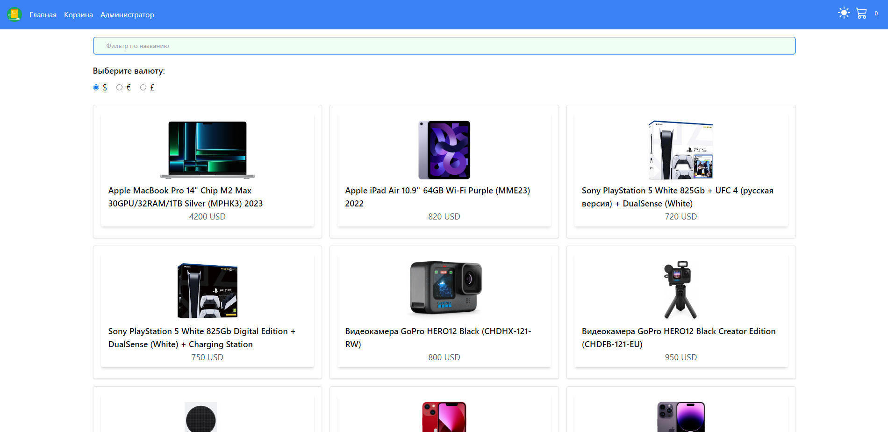

# OnlineShop



Diploma project of Online-Shop developed using **MEAN stack
(MongoDb, Node.js, Express.js and Angular v.16.1.6).**

**TailwindCSS** was used for styling.
Display of all data about products and the products themselves is realized through **MongoDB**.

#### From the functionality is present:

- switching the interface to a dark or light theme;
- selection of different currencies and recalculation of prices of all goods for each currency;
- detailed information about the product, with the ability to add comments to it;
- the purchased product goes to the shopping cart, where you can select the quantity of ordered goods;
- there is also a functionality in the cart, when filling out the form to purchase goods, the store manager will instantly receive a notification in messenger Telegram, with all the information from the form;
- there is an administrator panel, which is accessed using a password;
- in the administrator section you can add products to the database or delete products from it. All added products are displayed immediately on the main page. When deleted as well as immediately removed from it.
- there is addaptive for any device;
- there is a small check on the robot, if on the page to perform frequent single-type clicks and transitions between tabs of the application, will appear a message with a mathematical example. If the example is solved correctly the user will return to the main page, if the example is solved three times incorrectly, the page is blocked with a corresponding notification on the screen.

**Also, this project used Electron, the desktop version has the same functionality as the browser version.**

To run the project it must be cloned `git clone`.
Then install npm modules `npm install`.

Then to start the application run the command

```
npm run start
```

and

```
npm run mongo-server
```

and go to `localhost:4200`.

To start Electron version run the command

```
npm run electron-build
```

if it is necessary to create Electron files to install the application on desktop, run the command

```
npm run electron-package
```

**I know that .env files cannot be added to the repository, but I added it for the correct start of the application.**
